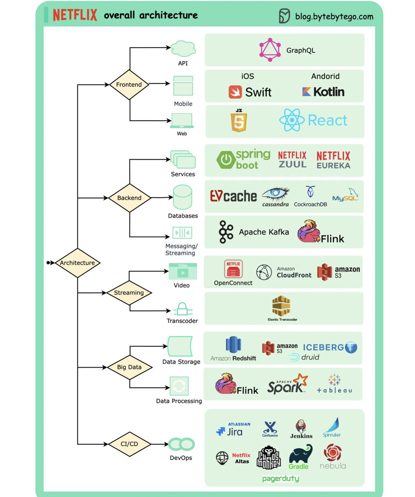

Atividade 1 - We see three critical differences between programming and software engineering: time, scale, and the trade-offs at play. On a software engineering project, engineers need to be more concerned with the passage of time and the eventual need for change. In a software engineering organization, we need to be more concerned about scale and efficiency, both for the software we produce as well as for the organization that is producing it. Finally, as software engineers, we are asked to make more complex decisions with higher-stakes outcomes, often based on imprecise estimates of time and growth.

Comentário: A engenharia de software valoriza mais o tempo de trabalho e sua relação com a eficiência, e profissionais dessa área trabalham com valores mais significativos de resultados, quando comparados com profissionais de programação.

Within Google, we sometimes say, “Software engineering is programming integrated over time.” Programming is certainly a significant part of software engineering: after all, programming is how you generate new software in the first place. If you accept this distinction, it also becomes clear that we might need to delineate between programming tasks (development) and software engineering tasks (development, modification, maintenance). The addition of time adds an important new dimension to programming. Cubes aren’t squares, distance isn’t velocity. Software engineering isn’t programming.

Comentário: Programação é uma parte da engenharia de software, porém aliada com a manutenção e modificação do que foi produzido. Novamente, nesse ramo o tempo se torna um aspecto valioso do trabalho.

Atividade 2 - Exemplos de trade-offs: 
1 - Python x Java - Python é uma linguagem de programação mais fácil de entender, porém de processamento mais lento. É adequado no caso de aprendizagem e tarefas mais simples, porém com um leque de possibilidades menor.
2 - Windows x Linux - Windows é um SO mais conhecido e amigável ao usuário, porém apresenta uma menor estabilidade e confiabilidade quando comparado ao Linux em um contexto de servidores.
3 - MySQL x MongoDB - MySQL possui uma maior integridade e consistência dos dados, porém apresentar uma menor flexibidade quando comparado ao MongoDB.

Atividade 3 - Trade-offs da arquitetura da Netflix

A arquitetura geral da Netflix é separada em diferentes seções específicas para cada área. Dentro dessas seções são utilizadas diferentes linguagens de acordo com suas vantagens naquele contexto. Observa-se a divisão em: Frontend (API, mobile, web), Backend (serviços, banco de dados, comunicação/streaming), Streaming (video, transcodificador), Big Data (armazenamento de dados, processamento de dados) e CI/CD (desenvolvimento e operações). Para cada uma dessas vertentes menores, são escolhidas as linguagens que melhor se adequam à sua função. Vale ressaltar que nenhum dos serviços utilizados é isento de desvantagens/defeitos, mas são escolhidos pontualmente visando suas tarefas especializadas.
