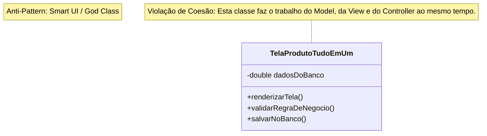

# MVC: Anti-Pattern

**Problema:** Colocar lógica de negócios na View ou lógica de apresentação no Model. Isso gera alto acoplamento e dificulta testes.
<br>

### Implementação incorreta
**TelaProdutoTudoEmUm.java**
```java
public class TelaProdutoTudoEmUm {
    // ANTI-PATTERN: A View guarda o dado E controla a regra de negócio.
    // Não há separação de responsabilidades.
    private double precoProduto;

    public void botaoAlterarPrecoPressionado(double novoPreco) {
        // Lógica de negócio na View (Errado)
        if (novoPreco < 0) {
            System.out.println("Erro: Preço inválido");
        } else {
            this.precoProduto = novoPreco;
            atualizarTela();
        }
    }

    public void atualizarTela() {
        // Lógica de apresentação misturada com dados
        System.out.println("Preço atualizado: " + this.precoProduto);
    }
}
```
<br>

### Diagrama UML
