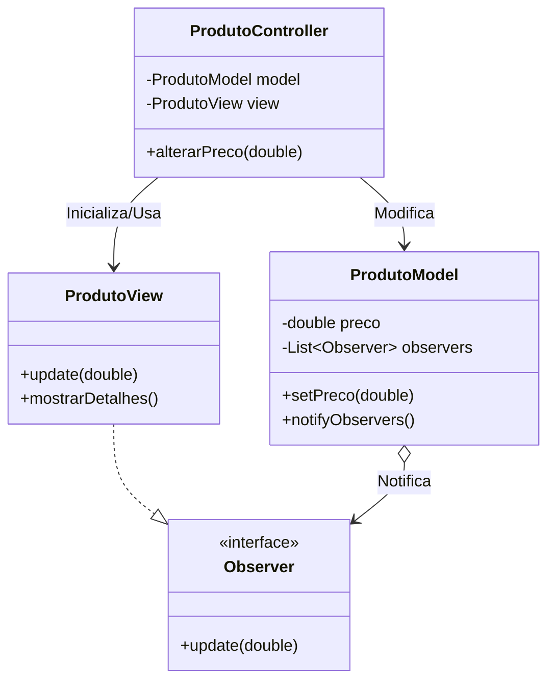

# MVC: Pattern

**Conceito**: O padrão MVC separa a aplicação em três componentes lógicos. O MVC moderno frequentemente combina Strategy (no Controller) e Observer (entre Model e View).
<br>

### Model
**ProdutoModel.java** - O Model deve estender ou implementar um Subject para notificar a View.
```java
import java.util.ArrayList;
import java.util.List;

public class ProdutoModel {
    private String nome;
    private double preco;
    private List<ProdutoObserver> observers = new ArrayList<>();

    public void setPreco(double preco) {
        this.preco = preco;
        notifyObservers(); // Notifica a View quando o dado muda
    }

    public double getPreco() { return preco; }

    // Pattern Observer integrado ao MVC
    public void addObserver(ProdutoObserver o) { observers.add(o); }
    
    private void notifyObservers() {
        for (ProdutoObserver o : observers) {
            o.update(this.preco);
        }
    }
}
```
<br>

### View
**ProdutoObserver.java** - A View implementa a interface Observer para se atualizar automaticamente.
```java
public interface ProdutoObserver {
    void update(double novoPreco);
}
```

**ProdutoView.java**
```java
public class ProdutoView implements ProdutoObserver {
    @Override
    public void update(double novoPreco) {
        System.out.println("VIEW ATUALIZADA: O novo preço é R$ " + novoPreco);
    }
    
    public void mostrarDetalhes(String nome, double preco) {
        System.out.println("Produto: " + nome + " | Preço: " + preco);
    }
}
```
<br>

### Controller
**ProdutoController.java** - Recebe a entrada do usuário e decide o que fazer com o Model.
```java
public class ProdutoController {
    private ProdutoModel model;
    private ProdutoView view;

    public ProdutoController(ProdutoModel model, ProdutoView view) {
        this.model = model;
        this.view = view;
        // Inscreve a View para observar o Model
        this.model.addObserver(this.view);
    }

    public void alterarPreco(double novoPreco) {
        // Regra de negócio ou validação poderia estar aqui
        if(novoPreco > 0) {
            model.setPreco(novoPreco);
        }
    }
}
```
<br>

### Execução
**Main.java**
```java
public class Main {
    public static void main(String[] args) {
        ProdutoModel model = new ProdutoModel();
        ProdutoView view = new ProdutoView();
        ProdutoController controller = new ProdutoController(model, view);

        // O usuário interage através do controller
        controller.alterarPreco(100.00);
        controller.alterarPreco(150.50);
    }
}
```
<br>

### Diagrama UML
