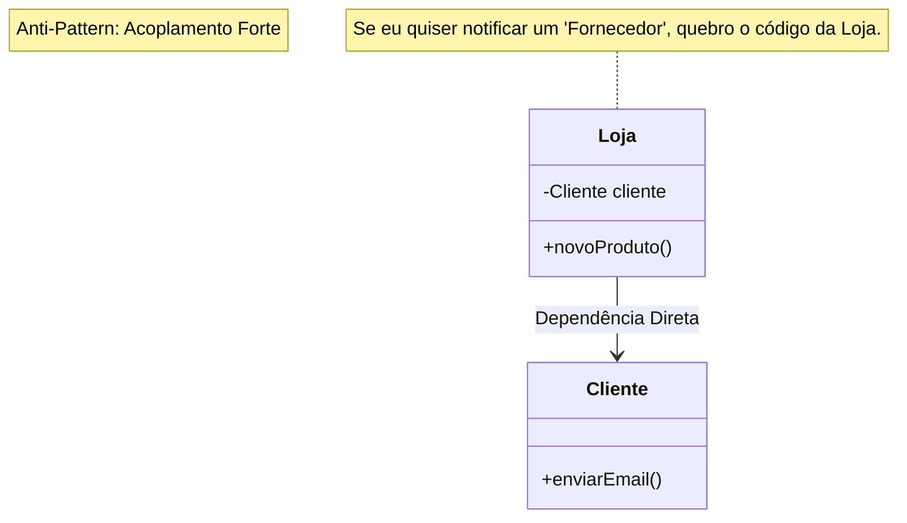

# Observer: Anti-Pattern

**Conceito:** O Subject conhece explicitamente a classe concreta do Observer. Isso impede que novos tipos de observadores sejam adicionados sem modificar o código do Subject.<br>
**Objetivo:** Definir uma dependência um-para-muitos entre objetos, de modo que quando um objeto muda de estado, todos os seus dependentes sejam notificados.<br>
**Problema:** Acoplamento Forte (Tight Coupling). O Subject conhece a classe concreta do Observer.
<br>

**Loja.java**
```java
public class Loja {
    // ANTI-PATTERN: A Loja depende diretamente da classe concreta 'Cliente'.
    // Se eu quiser notificar um 'Fornecedor' ou 'AppMobile', terei que mudar o código da Loja.
    private Cliente cliente; 

    public Loja(Cliente cliente) {
        this.cliente = cliente;
    }

    public void novoProdutoChegou() {
        // Acoplamento forte
        cliente.enviarEmail("Produto chegou!");
    }
}
```

### Diagrama UML
