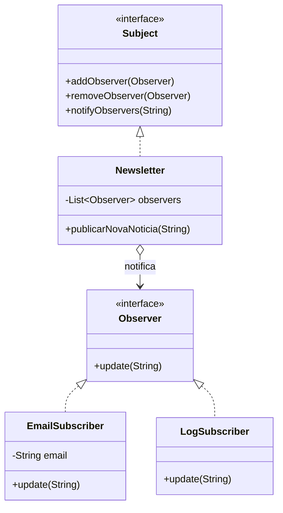

# Observer: Pattern

**Objetivo:** Definir uma dependência um-para-muitos entre objetos, de modo que quando um objeto muda de estado, todos os seus dependentes sejam notificados.
<br>
**Solução:** Usar interfaces para desacoplar o Subject (quem gera o evento) dos Observers (quem escuta).
<br>

### Interfaces
**Observer.java** - Quem escuta
```java
public interface Observer {
    void update(String mensagem);
}
```

**Subject.java** - Quem gera o evento
```java
public interface Subject {
    void addObserver(Observer observer);
    void removeObserver(Observer observer);
    void notifyObservers(String mensagem);
}
```
<br>

### Implementações corretas
**Newsletter.java** - Implementação do Subject
```java
import java.util.ArrayList;
import java.util.List;

public class Newsletter implements Subject {
    private List<Observer> observers = new ArrayList<>();

    @Override
    public void addObserver(Observer observer) {
        observers.add(observer);
    }

    @Override
    public void removeObserver(Observer observer) {
        observers.remove(observer);
    }

    @Override
    public void notifyObservers(String mensagem) {
        for (Observer observer : observers) {
            observer.update(mensagem);
        }
    }

    public void publicarNovaNoticia(String noticia) {
        System.out.println("Publicando notícia: " + noticia);
        notifyObservers(noticia);
    }
}
```

**EmailSubscriber.java** - Implementação do Observer
```java
public class EmailSubscriber implements Observer {
    private String email;

    public EmailSubscriber(String email) {
        this.email = email;
    }

    @Override
    public void update(String mensagem) {
        System.out.println("Email enviado para " + email + ": " + mensagem);
    }
}
```

**LogSubscriber.java** - Implementação do Observer
```java
public class LogSubscriber implements Observer {
    @Override
    public void update(String mensagem) {
        System.out.println("Log do sistema: Nova atualização recebida - " + mensagem);
    }
}
```
<br>

### Execução
**Main.java**
```java
public class Main {
    public static void main(String[] args) {
        Newsletter newsletter = new Newsletter();

        Observer usuario1 = new EmailSubscriber("joao@email.com");
        Observer usuario2 = new EmailSubscriber("maria@email.com");
        Observer sistemaLog = new LogSubscriber();

        newsletter.addObserver(usuario1);
        newsletter.addObserver(usuario2);
        newsletter.addObserver(sistemaLog);

        // Uma ação notifica todos os diferentes tipos de observadores
        newsletter.publicarNovaNoticia("Java 23 Lançado!");
    }
}
```
<br>

### Diagrama UML
