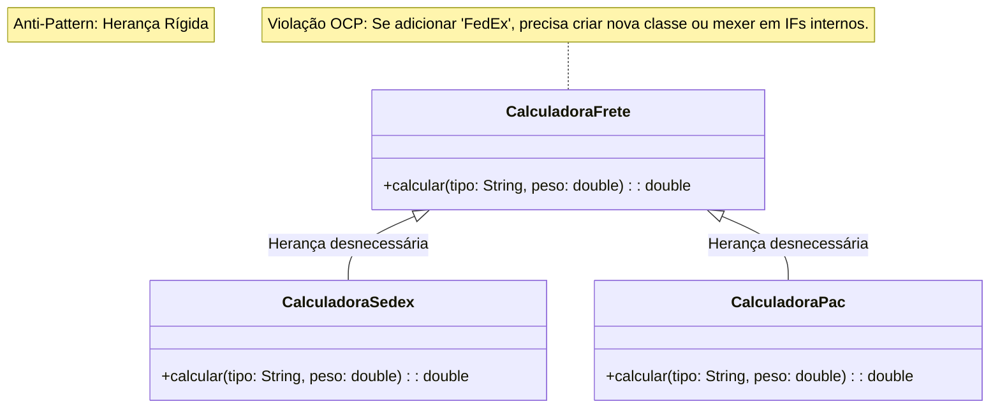

# Strategy: Anti-Pattern

**Conceito:** O uso de herança para variação de comportamento cria uma hierarquia rígida. Se um novo algoritmo é necessário, você é forçado a criar uma subclasse ou modificar uma lógica condicional gigante (switch/case), violando o Princípio Aberto/Fechado (OCP).
<br>
**Objetivo:** Definir uma família de algoritmos, encapsulá-los e torná-los intercambiáveis.
<br>
**Problema:** Uso excessivo de herança ou condicionais (if/else, switch) dentro da classe principal para alternar comportamentos.
<br>

### Implementação incorreta
**CalculadoraFrete.java**
```java
public class CalculadoraFrete {
    public double calcular(String tipo, double peso) {
        // ANTI-PATTERN: O código está "fechado" para modificação.
        // Se surgir um novo tipo, preciso alterar essa classe, violando o OCP (Open/Closed Principle).
        if (tipo.equals("SEDEX")) {
            return peso * 5.0;
        } else if (tipo.equals("PAC")) {
            return peso * 2.0;
        } else {
            return 0;
        }
    }
}
```
<br>

### Execução
**Main.java**
```java
public class Main {
    public static void main(String[] args) {
        CalculadoraFrete calc = new CalculadoraFrete();
        System.out.println("Frete: " + calc.calcular("SEDEX", 10));
    }
}
```
<br>

### Diagrama UML
