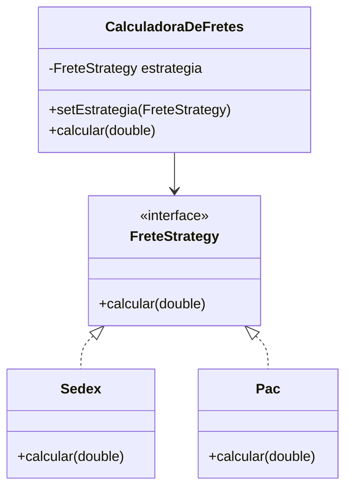

# Strategy: Pattern

**Objetivo:** Definir uma família de algoritmos, encapsulá-los e torná-los intercambiáveis.<br>
**Solução:** Usar uma Interface comum para as estratégias e compor a classe de contexto com essa interface.
<br>

### Interface
**FreteStrategy.java**
```java
public interface FreteStrategy {
    double calcular(double peso);
```
<br>

### Implementações corretas
**Sedex.java**
```java
public class Sedex implements FreteStrategy {
    @Override
    public double calcular(double peso) {
        System.out.println("Calculando via SEDEX...");
        return peso * 5.0;
    }
}
```

**Pac.java**
```java
public class Pac implements FreteStrategy {
    @Override
    public double calcular(double peso) {
        System.out.println("Calculando via PAC...");
        return peso * 2.0;
    }
}
```
<br>

### Contexto (quem usa a estratégia)
**CalculadoraDeFretes.java**
```java
public class CalculadoraDeFretes {
    private FreteStrategy estrategia;

    // Permite definir a estratégia no construtor ou via setter (intercambiável)
    public void setEstrategia(FreteStrategy estrategia) {
        this.estrategia = estrategia;
    }

    public double calcular(double peso) {
        if (estrategia == null) {
            throw new RuntimeException("Estratégia não definida!");
        }
        return estrategia.calcular(peso);
    }
}
```
<br>

### Diagrama UML
